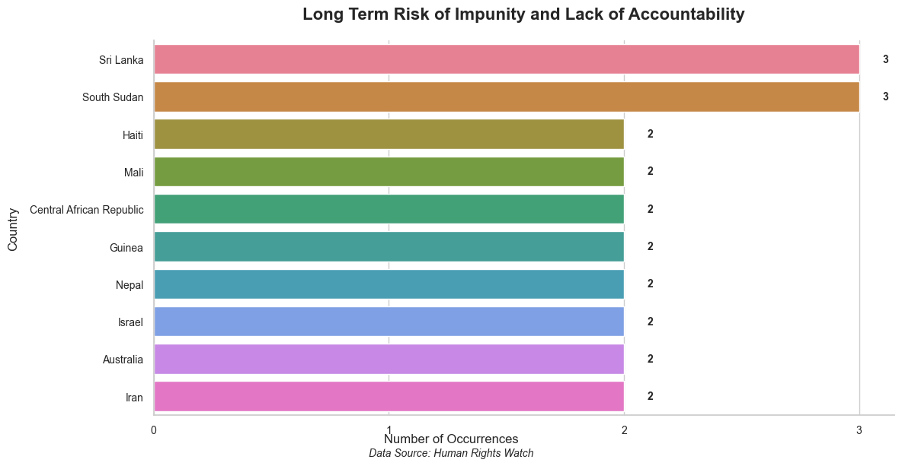

# Human Rights Violations Analysis 2024

## Project Overview

This project provides an in-depth analysis of human rights violations in 2024, based on news data from Human Rights Watch. It processes 401 articles to extract key information on accusations, risks, and affected victims, using Large Language Models (LLMs) to convert qualitative data into quantitative insights.

## Data Source

The project utilizes news articles published by Human Rights Watch from January 1, 2024, to August 28, 2024, as its primary data source.


The project initially used the GDELT API to identify and retrieve links to relevant articles.


## Methodology

The project employs a three-stage methodology:

### 1. Data Collection

- **GDELT API:** The project initially used the GDELT API to identify and retrieve links to 401 relevant articles from Human Rights Watch.
- **Web Scraping:** A custom web scraper was developed to extract the full text content and metadata from each article link obtained through the GDELT API.

### 2. Data Processing

- **LLM-Powered Qualitative to Quantitative Conversion:** OpenAI's GPT-4o-mini model was used to convert the qualitative textual data from the articles into structured, quantitative data. This involved:
    - **Accusation Categories:** The LLM was prompted to identify and categorize specific types of human rights violations mentioned in each article.
    - **Risk Analysis:** The LLM analyzed articles to identify potential long-term consequences of human rights violations.
    - **Victim Demographics:** The LLM extracted and categorized information about affected groups.
- **Prompt Engineering and Data Structuring:** Carefully crafted prompts were used to guide the LLM in extracting relevant information and formatting it in a consistent, quantifiable manner. This process involved:
    - Feeding article text to the LLM with specific instructions.
    - Parsing the LLM's structured output into a format suitable for data analysis.
    - Aggregating results across all articles to generate quantitative datasets.

### 3. Data Analysis and Visualization

- **Python Libraries:** Python libraries such as pandas, matplotlib, and seaborn were used to process the quantified data and create visual representations.
- **Analysis Focus:** The analysis focused on identifying patterns, trends, and correlations within and across the three main categories: accusations, risks, and victims.
- **Visualizations:** The analysis is presented through a series of data visualizations, including:
    - **Accusations:** Bar charts and heatmaps showing the frequency and co-occurrence of different types of human rights violation accusations.
    - **Risks:** Bar charts and heatmaps showing the frequency and co-occurrence of different types of risks.
    - **Victims:** Demographic breakdowns and geographical distributions of affected groups, presented through pie charts and choropleth maps.




## Project Structure

The project is organized into the following directories:

- **data:** Contains the raw and processed data files, including the CSV file with extracted information from the articles.
- **docs:** Contains the HTML, CSS, and JavaScript files for the website that presents the data visualizations, as well as the generated plots.
- **processing:** Contains the Python scripts used for data processing, including the scripts for interacting with the OpenAI API and generating the visualizations.
    - **news_scraper:** Contains the script for scraping news articles from Human Rights Watch.
        - `scraper.py`: This script uses the GDELT API to find relevant articles and then scrapes the full text and metadata from each article.
    - **information_parser:** Contains scripts for extracting information from the articles using LLMs.
        - `accusation_categories.py`: This script uses an LLM to identify and categorize accusations of human rights violations in each article.
        - `long_term_consequences.py`: This script uses an LLM to identify potential long-term consequences of human rights violations mentioned in each article.
        - `victim_categories.py`: This script uses an LLM to identify and categorize information about victims of human rights violations in each article.


## Requirements

The project requires the following Python libraries:

- newspaper3k
- requests
- openai
- pandas
- numpy
- matplotlib
- seaborn
- scipy
- scikit-learn
- python-dotenv

## Running the Project

1. **Install Requirements:** Install the required Python libraries using pip:
   ```bash
   pip install -r requirements.txt
   ```
2. **Set up OpenAI API Key:** Create a `.env` file in the root directory of the project and add your OpenAI API key:
   ```
   OPENAI_API_KEY=your_api_key_here
   ```
3. **Run Data Processing Scripts:** Run the Python scripts in the `processing` directory to extract information from the articles, categorize the data, and generate the visualizations.
4. **View Visualizations:** Open the HTML files in the `docs` directory in a web browser to view the data visualizations. You can visit the live website at tugberkcapraz.github.io/HRW.

## Limitations and Future Work

- **Model Biases:** The LLM-based approach may be subject to biases inherent in the language model.
- **Human Verification:** The LLM's output may require human verification to ensure accuracy and reliability.
- **Future Work:**
    - Refining the prompts used to guide the LLM.
    - Incorporating multiple LLMs for cross-validation.
    - Integrating expert human review to enhance the accuracy and reliability of the findings.
